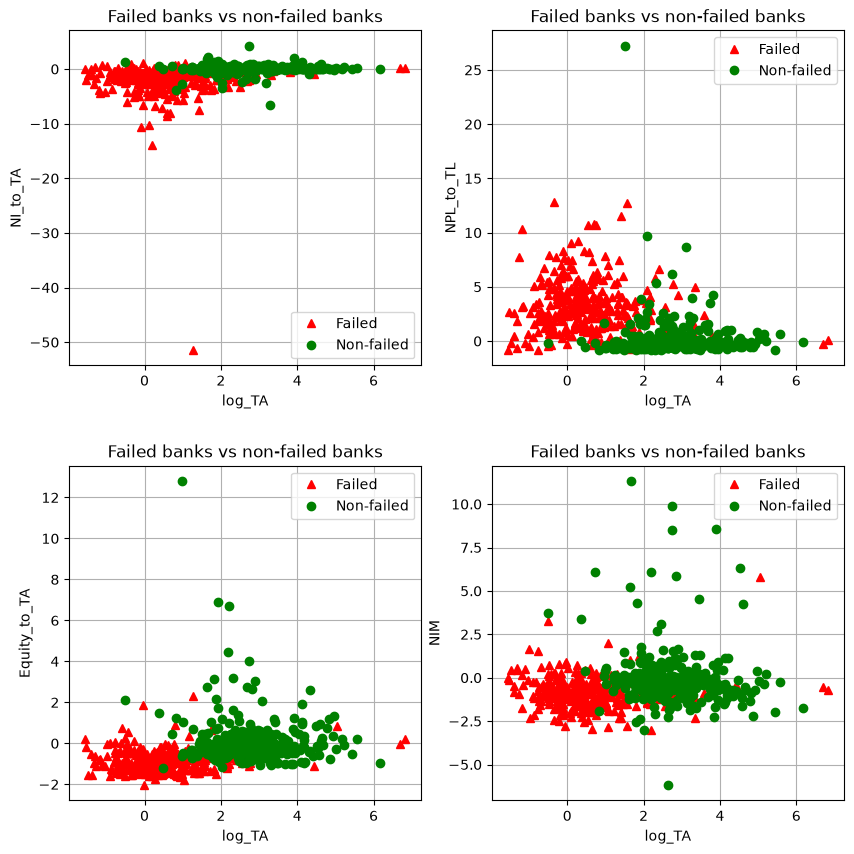
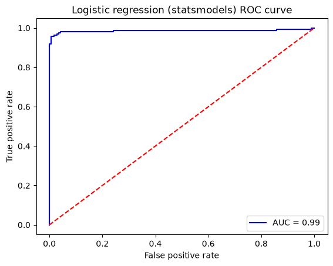

# Predicting U.S. Bank Failures with Machine Learning

Can a bank's balance sheet tell us whether it will fail within the next year? This project classifies U.S. banks as failed / non-failed using quarterly financial ratios from regulatory Call Reports together with macroeconomic variables, and compares four models: a statistical logistic regression, a regularised logistic regression, the same model trained by gradient descent, and a small neural network.

The work started from an assignment in the Coursera course *Guided Tour of Machine Learning in Finance* (NYU Tandon). I rewrote it as a standalone project, fixing several issues in the original code along the way.

## Data

Each observation is a bank at a given quarter, labelled `defaulter = 1` if the bank failed. The training set has 641 observations and the test set 331. The sample is roughly balanced: about half of the test banks failed.

**Bank-level predictors** (standardised):

- `log_TA`: log of total assets (bank size)
- `NI_to_TA`: net income / total assets (profitability)
- `Equity_to_TA`: equity / total assets (capitalisation)
- `NPL_to_TL`: non-performing loans / total loans (credit quality)
- `REO_to_TA`: real estate owned (foreclosed property) / total assets
- `ALLL_to_TL`: allowance for loan and lease losses / total loans (reserves against expected loan losses)
- `core_deposits_to_TA`: core deposits / total assets (stable funding)
- `brokered_deposits_to_TA`: brokered deposits / total assets (volatile, rate-sensitive funding)
- `liquid_assets_to_TA`: liquid assets / total assets (liquidity buffer)
- `loss_provision_to_TL`: provision for loan losses / total loans (losses recognised over the quarter)
- `NIM`: net interest margin (interest income minus interest expense, relative to earning assets)
- `assets_growth`: growth rate of total assets

**Macroeconomic predictors**:

- `term_spread`: long-term minus short-term Treasury yield (slope of the yield curve)
- `stock_mkt_growth`: stock market index growth
- `real_gdp_growth`: real GDP growth
- `unemployment_rate_change`: change in the unemployment rate
- `treasury_yield_3m`: 3-month Treasury bill yield
- `bbb_spread`: BBB corporate bond yield minus Treasury yield (credit risk premium)
- `bbb_spread_change`: change in the BBB spread
```
data/df_train_FDIC_defaults_1Y.h5
data/df_test_FDIC_defaults_1Y.h5
```

## Models

| Model | Implementation | Details |
|---|---|---|
| Logistic regression | statsmodels `Logit` | MLE fit, coefficient p-values |
| L1 logistic regression | scikit-learn | `C = 1000`, liblinear solver, full and reduced predictor sets |
| Logistic regression (GD) | TensorFlow | mini-batch gradient descent on log loss, batch size 50, lr 0.01 |
| Neural network | TensorFlow | 2 hidden layers (20, 10, ReLU), softmax output, cross-entropy loss |

## Results (test set, 331 banks)

| Model | Predictors | Accuracy | ROC AUC | KS statistic |
|---|---|---|---|---|
| Logistic regression (statsmodels) | 19 | 97.0% | 0.986 | 0.951 |
| L1 logistic regression (scikit-learn) | 19 | 97.0% | – | – |
| L1 logistic regression, reduced set | 9 | 96.4% | – | – |
| Logistic regression (TensorFlow, GD) | 19 | 96.7% | 0.985 | 0.945 |
| Neural network (20-10) | 19 | 97.6% | – | – |

The TensorFlow logistic regression reaches a precision of 96.3% and a recall of 96.9% on failed banks.

<p align="center">
  
  
</p>

### Findings

- **Bank fundamentals drive the prediction, macro variables do not.** In the statsmodels fit, the predictors significant at the 5% level are size (−), equity / assets (−), non-performing loans (+), core deposits (−), liquid assets (−) and loss provisions (+). None of the seven macroeconomic variables is significant. This makes sense for a cross-section in which banks observed at the same date share the same macro values, so macro variables cannot explain which banks fail.
- **A simple logistic regression is as good as the neural network.** The network's 0.6-point accuracy edge amounts to about two banks out of 331, well within the noise of a single train/test split.
- **The classes are nearly separable on a handful of ratios.** Failed banks are smaller, thinly capitalised and carry far more bad loans (see the scatter plots above).

## Limitations

These scores should not be read as real-world performance:

**Balanced sample.** Roughly half the banks in the data failed, while the actual annual failure rate of U.S. banks is a small fraction of a percent. On a realistic population, precision would be much lower for the same recall.


## How to run

```bash
pip install -r requirements.txt
jupyter notebook bank_failure_prediction.ipynb
```

Tested with Python 3.14, scikit-learn 1.9 and TensorFlow 2.22.

## Repository structure

```
├── bank_failure_prediction.ipynb   # full analysis
├── images/                         # figures used in this README
├── requirements.txt
└── README.md
```


## Acknowledgements

Based on an assignment from *Guided Tour of Machine Learning in Finance* (NYU Tandon School of Engineering, Coursera). Data preprocessing by the course authors.
